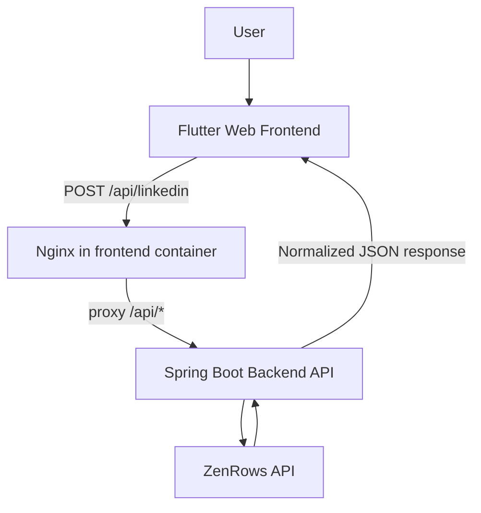

# LinkedIn Profile Scraper

A multi-module implementation of a LinkedIn profile scraping challenge. The backend API accepts a LinkedIn profile URL and returns structured JSON built from scraped data.

This repository contains:

- **`scrapper-backend`**: Spring Boot REST API (core application)
- **`scrapper-frontend`**: Flutter Web client for visualizing scraped results (demo/visualization layer)
- **`docker-compose.yml`**: Runs backend and frontend together

## Features

Implemented capabilities verified from code:

- Scrape endpoint that accepts a LinkedIn profile URL (`POST /api/linkedin`)
- Three parser modes via query param: `hybrid` (default), `html`, `parsed`
- Structured profile extraction for available fields such as:
  - name/fullName, headline/description, location
  - current position
  - experience
  - education
  - languages
  - posts and articles
  - profile/cover images
- OpenAPI + Swagger UI (`/api-docs`, `/swagger-ui.html`)
- Global API error payloads for bad requests, upstream failures, and unexpected errors
- Dockerized backend and frontend
- Nginx reverse proxy in frontend container for same-origin API/docs routing

> Current implementation does **not** expose dedicated structured fields for skills or certifications.

## Architecture



Component responsibilities:

- **Frontend (`scrapper-frontend`)**: collects profile URL input, calls API, renders profile sections.
- **Backend (`scrapper-backend`)**: validates/dispatches scrape mode, calls scraping provider, parses/merges output, returns JSON.
- **Scraping/data layer**:
  - `ZenRowsClient`: calls ZenRows (`extract=auto`, JS render, premium proxy).
  - `ParsedJsonScraperService`: maps ZenRows parsed payload.
  - `HtmlScraperService`: parses returned HTML/JSON-LD via Jsoup + Jackson.
  - `HybridScrapperService`: merges parsed + HTML data with fallback/deduping heuristics.
- **Nginx (`scrapper-frontend/nginx.conf`)**: serves Flutter static files and proxies `/api`, `/swagger-ui`, `/api-docs` to backend.

## Project Structure

```text
linkedin-scrapper/
├── pom.xml                         # parent Maven module descriptor
├── docker-compose.yml              # backend + frontend services
├── .env                            # runtime secret file used by docker compose (gitignored)
├── scrapper-backend/
│   ├── pom.xml                     # Spring Boot backend module
│   ├── Dockerfile
│   ├── mvnw / mvnw.cmd
│   └── src/main/
│       ├── java/com/curiodesk/scrapperbackend/
│       │   ├── controller/         # REST endpoint
│       │   ├── service/            # scraping + parsing + merge services
│       │   ├── api/request/        # request model
│       │   ├── api/response/       # response models
│       │   ├── config/             # CORS + OpenAPI config
│       │   └── exception/          # exception types + global handler
│       └── resources/application.yaml
└── scrapper-frontend/
    ├── pubspec.yaml                # Flutter dependencies
    ├── Dockerfile
    ├── nginx.conf
    └── lib/
        ├── services/api_service.dart
        ├── models/linkedin_profile.dart
        └── pages/home_page.dart
```

## Prerequisites

Verified prerequisites from repository configuration:

- **Java 21** (backend build/runtime)
- **Maven Wrapper** in `scrapper-backend` (`mvnw`, `mvnw.cmd`)
- **Flutter SDK** with web support (frontend local run)
- **A Flutter-supported browser** (e.g., Chrome)
- **Docker + Docker Compose** (containerized run)

## Configuration & Environment Variables

### Required

| Variable | Used by | Required | Purpose | Example |
|---|---|---|---|---|
| `ZENROWS_API_KEY` | backend (`zenrows.api_key`) | Yes | Auth key for ZenRows scraping requests | `ZENROWS_API_KEY=your_api_key_here` |

### Optional/overrideable

| Variable | Required | Purpose |
|---|---|---|
| `API_BASE_URL` (Flutter `--dart-define`) | No | Frontend API/docs base URL override; empty means same-origin relative paths |
| `CORS_ALLOWED_ORIGIN_PATTERNS` (Spring relaxed binding for `cors.allowed-origin-patterns`) | No | Override allowed CORS origin patterns for `/api/**` |

Notes:

- Root `.env` is referenced by `docker-compose.yml` for the backend service.
- `.env` is gitignored; keep secrets out of source control.
- No `.env.example` file is currently present in this repository.

## Running the Backend Locally

1. Set `ZENROWS_API_KEY`.

**PowerShell (Windows):**

```powershell
$env:ZENROWS_API_KEY="your_api_key_here"
```

**bash (macOS/Linux):**

```bash
export ZENROWS_API_KEY="your_api_key_here"
```

2. Start backend from repo root:

**PowerShell (Windows):**

```powershell
.\scrapper-backend\mvnw.cmd -f .\scrapper-backend\pom.xml spring-boot:run
```

**bash (macOS/Linux):**

```bash
cd scrapper-backend
./mvnw spring-boot:run
```

3. Backend endpoints:

- Base URL: `http://localhost:8080`
- Swagger UI: `http://localhost:8080/swagger-ui.html`
- OpenAPI JSON: `http://localhost:8080/api-docs`

## Running the Frontend Locally

The frontend is a visualization/demo client. The backend can run independently.

1. Open frontend module:

```bash
cd scrapper-frontend
```

2. Install dependencies:

```bash
flutter pub get
```

3. Run Flutter web:

```bash
flutter run -d chrome
```

Optional API override:

```bash
flutter run -d chrome --dart-define=API_BASE_URL=http://localhost:8080
```

Default behavior (no `API_BASE_URL`):

- Frontend calls relative `/api/linkedin`.
- API docs button opens `/swagger-ui/index.html` relative to current origin.

## Running Everything with Docker Compose

1. Ensure root `.env` contains the required key:

```env
ZENROWS_API_KEY=your_api_key_here
```

2. From repository root:

```bash
docker compose up --build
```

3. Services and ports:

- Frontend: `http://localhost` (container port 80 -> host 80)
- Backend: `http://localhost:8080` (container port 8080 -> host 8080)

4. Container-to-container communication:

- Frontend Nginx proxies `/api/*` to `http://backend:8080` on the compose network.
- This keeps browser requests same-origin at `http://localhost`.

5. Swagger with Docker:

- `http://localhost/swagger-ui.html`
- `http://localhost/swagger-ui/index.html`
- `http://localhost/api-docs`

6. Stop services:

```bash
docker compose down
```

## API Documentation

Base path: `/api`

### `POST /api/linkedin`

Scrapes a LinkedIn public profile URL and returns one of three response schemas based on `type`.

#### Query parameters

| Parameter | Required | Allowed values | Default | Behavior |
|---|---|---|---|---|
| `type` | No | `hybrid`, `html`, `parsed` | `hybrid` | Chooses parser/response mode |

- `hybrid`: merged response from parsed payload + HTML extraction with deduping/fallbacks
- `html`: HTML/JSON-LD extraction response
- `parsed`: normalized mapping from ZenRows parsed payload

#### Request body

```json
{
  "url": "https://www.linkedin.com/in/example/"
}
```

#### cURL examples

**Default (`hybrid`)**

```bash
curl -X POST "http://localhost:8080/api/linkedin" \
  -H "Content-Type: application/json" \
  -d '{"url":"https://www.linkedin.com/in/example/"}'
```

**Explicit `html` mode**

```bash
curl -X POST "http://localhost:8080/api/linkedin?type=html" \
  -H "Content-Type: application/json" \
  -d '{"url":"https://www.linkedin.com/in/example/"}'
```

**Explicit `parsed` mode**

```bash
curl -X POST "http://localhost:8080/api/linkedin?type=parsed" \
  -H "Content-Type: application/json" \
  -d '{"url":"https://www.linkedin.com/in/example/"}'
```

#### Success response shapes (summary)

- **`hybrid`**: `profileUrl`, `vanityUrl`, `fullName`, `headline`, `description`, `currentPosition`, `location`, `countryCode`, `followerCount`, `connectionCount`, `profilePhotoUrl`, `coverImageUrl`, `languages[]`, `posts[]`, `articles[]`, `experiences[]`, `education[]`
- **`parsed`**: `profileUrl`, `vanityUrl`, `fullName`, `headline`, `currentPosition`, `location`, `countryCode`, `followerCount`, `connectionCount`, `profilePhotoUrl`, `coverImageUrl`, `languages[]`, `posts[]`, `experiences[]`
- **`html`**: `name`, `profileUrl`, `description`, `location`, `profileImage`, `coverImage`, `followers`, `experience[]`, `education[]`, `articles[]`, `posts[]`, `links[]`

#### Error responses

Errors use a standard payload:

```json
{
  "timestamp": "2026-08-28T14:00:00Z",
  "status": 400,
  "error": "Bad Request",
  "message": "Malformed request",
  "path": "/api/linkedin"
}
```

Typical statuses from `GlobalExceptionHandler`:

- `400` invalid `type`, malformed JSON, missing/invalid request data
- `502` upstream ZenRows issues (e.g., missing API key, request/parsing failures)
- `500` unexpected internal errors

## Implementation Notes (Technical Approach)

- The backend depends on ZenRows as the upstream fetch/extraction provider.
- ZenRows response fields used:
  - `html` (raw HTML returned by provider)
  - `parsed` object fields (member/current_position/experience/posts/languages)
- `HtmlScraperService` parses HTML using:
  - CSS selectors for top-card basics/images
  - JSON-LD blocks for person/article/post metadata
  - anchor extraction for unique links
- `HybridScrapperService` performs:
  - field-level preference/fallback selection
  - post/article/experience/education deduplication
  - education-vs-experience correction heuristics using keyword hints

## Known Limitations

- Scraping quality depends on ZenRows upstream response quality and LinkedIn page variability.
- If `ZENROWS_API_KEY` is missing/invalid, scraping requests fail.
- Only one scrape endpoint is exposed (`POST /api/linkedin`); no async queueing/persistence layer is implemented.
- No built-in rate limiting, retry orchestration, or caching layer is implemented.
- Output schema differs by `type` mode (`hybrid`, `html`, `parsed`) rather than a single strict universal schema.
- The implementation currently focuses on fields listed in DTOs/services and does not provide dedicated skills/certifications fields.
- Public HTTPS hosting/deployment configuration is not part of this repository; it must be provided by your target runtime/platform.

## Security Notes

- Do not commit secrets.
- Keep `ZENROWS_API_KEY` in environment variables (or root `.env` for local compose) only.
- `.env` is already excluded via `.gitignore`.
