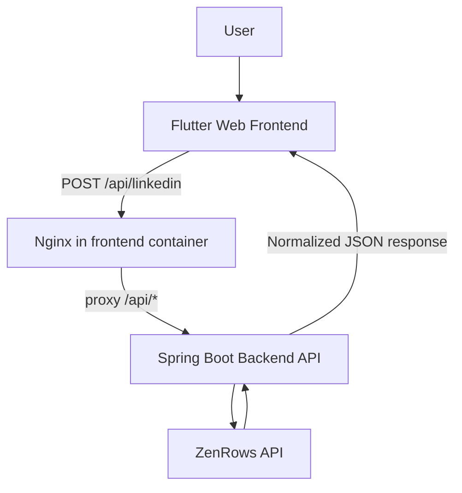

# Architecture



## Component responsibilities

- **Frontend (`scraper-frontend`)**: collects profile URL input, calls API, renders profile sections.
- **Backend (`scraper-backend`)**: validates/dispatches scrape mode, calls scraping provider, parses/merges output, returns JSON.
- **Scraping/data layer**:
  - `ZenRowsClient`: calls ZenRows (`extract=auto`, JS render, premium proxy).
  - `ParsedJsonScraperService`: maps ZenRows parsed payload.
  - `HtmlScraperService`: parses returned HTML/JSON-LD via Jsoup + Jackson.
  - `HybridScraperService`: merges parsed + HTML data with fallback/deduping heuristics.
- **Nginx (`scraper-frontend/nginx.conf`)**: serves Flutter static files and proxies `/api`, `/swagger-ui`, `/api-docs` to backend.

## Project Structure

```text
linkedin-scraper/
├── pom.xml                         # parent Maven module descriptor
├── docker-compose.yml              # backend + frontend services
├── .env                            # runtime secret file used by docker compose (gitignored)
├── scraper-backend/
│   ├── pom.xml                     # Spring Boot backend module
│   ├── Dockerfile
│   ├── mvnw / mvnw.cmd
│   └── src/main/
│       ├── java/com/curiodesk/scraperbackend/
│       │   ├── controller/         # REST endpoint
│       │   ├── service/            # scraping + parsing + merge services
│       │   ├── api/request/        # request model
│       │   ├── api/response/       # response models
│       │   ├── config/             # CORS + OpenAPI config
│       │   └── exception/          # exception types + global handler
│       └── resources/application.yaml
└── scraper-frontend/
    ├── pubspec.yaml                # Flutter dependencies
    ├── Dockerfile
    ├── nginx.conf
    └── lib/
        ├── services/api_service.dart
        ├── models/linkedin_profile.dart
        └── pages/home_page.dart
```
